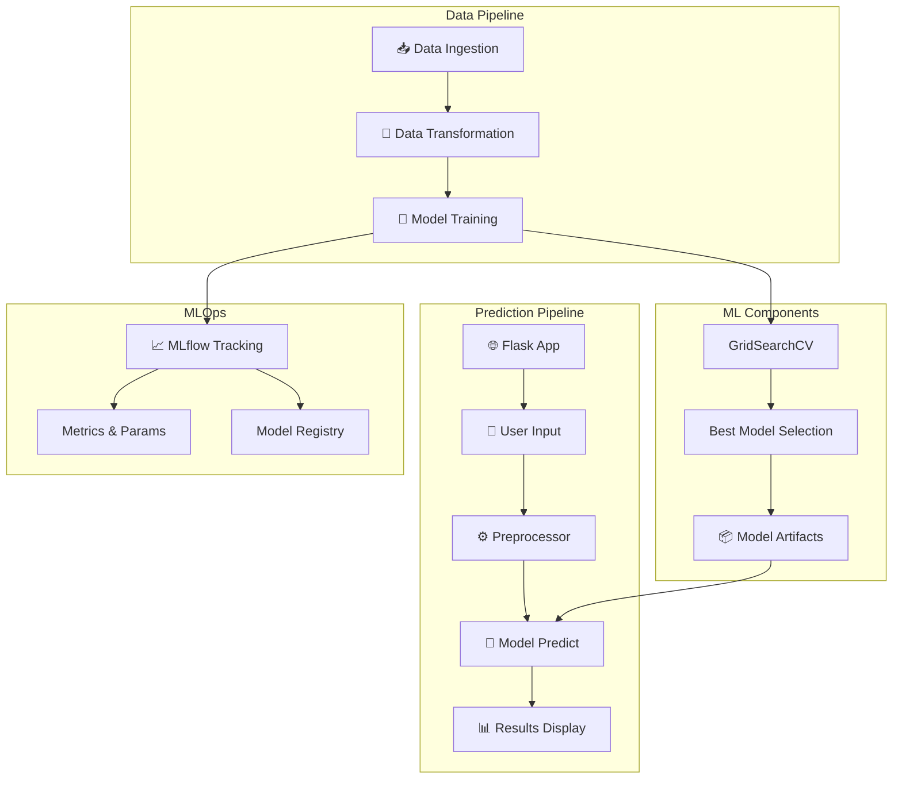

# 🎓 Student Performance Predictor

<div align="center">


**An end-to-end Machine Learning project that predicts student math scores based on demographic and academic factors.**

[Live Demo](#deployment) • [Features](#features) • [Architecture](#architecture) • [Installation](#installation) • [Usage](#usage)

</div>

---

## 📋 Problem Statement

Educational institutions need early indicators to identify students who may need additional support. This project predicts a student's **math score** based on:

- **Demographics**: Gender, race/ethnicity
- **Socioeconomic factors**: Parental education level, lunch type
- **Academic preparation**: Test preparation course completion
- **Other scores**: Reading and writing scores

> **Dataset**: [Student Performance Dataset](https://www.kaggle.com/datasets/spscientist/students-performance-in-exams) from Kaggle (1000 students)

---

## ✨ Features

| Feature | Description |
|---------|-------------|
| 🧠 **7 ML Models** | Compares Linear Regression, Decision Tree, Random Forest, Gradient Boosting, XGBoost, CatBoost, and AdaBoost |
| 🔧 **Hyperparameter Tuning** | Uses GridSearchCV for optimal model performance |
| 📊 **MLflow Integration** | Experiment tracking, metrics logging, and model registry |
| 🌐 **Flask Web App** | Modern glassmorphism UI with real-time predictions |
| 🐳 **Docker Ready** | Containerized deployment with multi-stage builds |
| ✅ **Unit Tests** | Comprehensive test suite with pytest |
| 📝 **Modular Code** | Clean architecture with separate components for data ingestion, transformation, and training |

---

## 🏗️ Architecture



---

## 📁 Project Structure

```
mlproject/
├── 📂 artifacts/           # Trained models & processed data
│   ├── model.pkl
│   ├── preprocessor.pkl
│   ├── train.csv
│   └── test.csv
├── 📂 notebook/            # EDA & experimentation notebooks
│   ├── 1. EDA STUDENT PERFORMANCE.ipynb
│   └── 2. MODEL TRAINING.ipynb
├── 📂 src/
│   ├── 📂 components/      # ML pipeline components
│   │   ├── data_ingestion.py
│   │   ├── data_transformation.py
│   │   └── model_trainer.py
│   ├── 📂 pipeline/        # Training & prediction pipelines
│   │   ├── predict_pipeline.py
│   │   └── train_pipeline.py
│   ├── exception.py        # Custom exception handling
│   ├── logger.py           # Logging configuration
│   └── utils.py            # Utility functions
├── 📂 static/              # Frontend assets
│   ├── css/styles.css
│   └── js/main.js
├── 📂 templates/           # HTML templates
│   ├── index.html
│   └── home.html
├── 📂 tests/               # Unit tests
├── app.py                  # Flask application
├── Dockerfile
├── requirements.txt
└── setup.py
```

---

## 📊 Model Results

| Model | R² Score | Training Time |
|-------|----------|---------------|
| Linear Regression | 0.87 | 0.1s |
| Decision Tree | 0.78 | 0.2s |
| Random Forest | 0.88 | 2.5s |
| Gradient Boosting | 0.87 | 3.1s |
| **XGBoost** | **0.89** | 1.8s |
| CatBoost | 0.88 | 2.2s |
| AdaBoost | 0.85 | 1.5s |

> 🏆 **Best Model**: XGBoost Regressor with R² = 0.89

---

## 🚀 Installation

### Prerequisites
- Python 3.10+
- pip or conda

### Local Setup

```bash
# Clone the repository
git clone https://github.com/Ahmed-Rizk1/mlproject.git
cd mlproject/mlproject

# Create virtual environment
python -m venv .venv
.venv\Scripts\activate  # Windows
# source .venv/bin/activate  # Linux/Mac

# Install dependencies
pip install -r requirements.txt

# Run the application
python app.py
```

### Docker Setup

```bash
# Build the image
docker build -t student-predictor .

# Run the container
docker run -p 5000:5000 student-predictor
```

---

## 💻 Usage

### Web Interface

1. Navigate to `http://localhost:5000`
2. Click **"Get Prediction"** on the landing page
3. Fill in the student information form
4. Click **"Predict Math Score"**
5. View the predicted score with performance feedback

### Training Pipeline

```python
from src.components.data_ingestion import DataIngestion
from src.components.data_transformation import DataTransformation
from src.components.model_trainer import ModelTrainer

# Run full pipeline
ingestion = DataIngestion()
train_path, test_path = ingestion.initiate_data_ingestion()

transformation = DataTransformation()
train_arr, test_arr, _ = transformation.initiate_data_transformation(train_path, test_path)

trainer = ModelTrainer()
r2_score = trainer.initiate_model_trainer(train_arr, test_arr)
print(f"Best Model R² Score: {r2_score}")
```

### MLflow Tracking

```bash
# Start MLflow UI
mlflow ui --port 5001

# View at http://localhost:5001
```

---

## 🧪 Running Tests

```bash
# Run all tests
pytest tests/ -v

# Run with coverage
pytest tests/ --cov=src --cov-report=html
```

---

## 🐳 Deployment

### Docker
```bash
docker build -t student-predictor .
docker run -d -p 5000:5000 student-predictor
```

### Vercel (Serverless)
The project includes `vercel.json` for serverless deployment:
```bash
vercel deploy
```

---

## 🛠️ Tech Stack

- **Backend**: Flask, Gunicorn
- **ML**: scikit-learn, XGBoost, CatBoost
- **MLOps**: MLflow
- **Frontend**: HTML5, CSS3 (Glassmorphism), JavaScript
- **Containerization**: Docker
- **Testing**: pytest

---

## 📈 Future Improvements

- [ ] Add more feature engineering
- [ ] Implement model explainability (SHAP)
- [ ] Add real-time model monitoring
- [ ] CI/CD pipeline with GitHub Actions
- [ ] Deploy to AWS/GCP

---

## 🤝 Contributing

1. Fork the repository
2. Create a feature branch (`git checkout -b feature/amazing-feature`)
3. Commit your changes (`git commit -m 'Add amazing feature'`)
4. Push to the branch (`git push origin feature/amazing-feature`)
5. Open a Pull Request

---

## 📄 License

This project is licensed under the MIT License - see the [LICENSE](LICENSE) file for details.

---

<div align="center">

**Built with ❤️ by [Ahmed Rizk](https://github.com/Ahmed-Rizk1)**

⭐ Star this repo if you find it helpful!

</div>